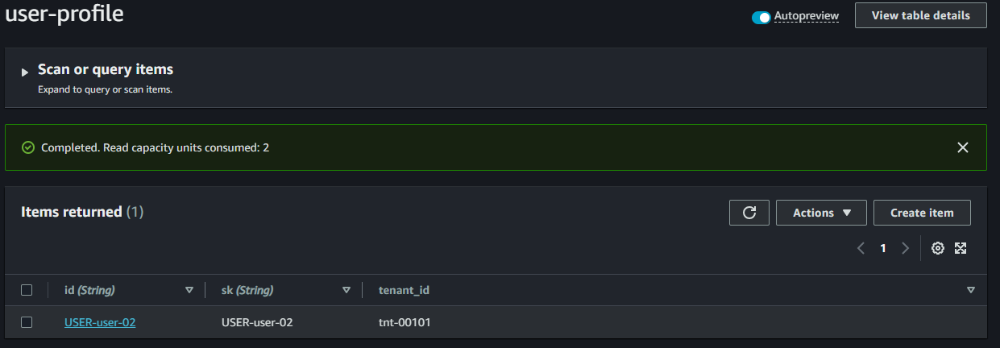

# lambda-go-auth-apigw

POC Lambda for technical purposes

Lambda apigw authorizer for check JWT OAuth 2.0

There is a table user-profile where the lambda get some data from the profile and inject into http headers. 

This lambda must be used attached as an authorizer into an ApiGateway

There are 2 types of validation

## Types of validation

### ScopeValidation(token, method, path)

Test, signed validation and all scopes

The scopes are :

      "header.read" : Method header with GET
      "version.read":  Method version with POST
      "info.read": Method info with GET
      "admin": Allowed all access
      "header" Method header with ANY allowed

### TokenValidation(token)

Just test and signed validation the JWT

## Compile lambda

   Manually compile the function

      GOOD=linux GOARCH=amd64 go build -o ../build/main main.go

      zip -jrm ../build/main.zip ../build/main

        aws lambda update-function-code \
        --function-name lambda-go-auth-apigw \
        --zip-file fileb:///mnt/c/Eliezer/workspace/github.com/lambda-go-auth-apigw/build/main.zip \
        --publish

## Test via console

      no mTLS
      {
            "headers": { "authorization": "eyJhb.....uG-Qy-0" },
            "methodArn": "rn:aws:execute-api:us-east-2:908671954593:k0ng1bdik7/qa/GET/account/info"
      }

      with mTLS
      {
            "headers": { "authorization": "eyJhbGc......lkuG-Qy-0" },
                  "methodArn": "rn:aws:execute-api:us-east-2:908671954593:k0ng1bdik7/qa/GET/account/info",
                  "requestContext": {
                        "identity": {
                              "clientCert": {
                              "clientCertPem": "-----BEGIN CERTIFICATE-----\nMIIF......aw==\n-----END CERTIFICATE-----\n"
                              }
                        }
            }
      }

## Lambda Env Variables

      APP_NAME	lambda-go-auth-apigw
      CRL_BUCKET_NAME_KEY	eliezerraj-908671954593-mtls-truststore
      CRL_FILE_KEY	crl_ca.pem
      CRL_FILE_PATH	/
      CRL_VALIDATION	false
      JWT_KEY	my_secret_key
      REGION	us-east-2
      SCOPE_VALIDATION	true
      SSM_JWT_KEY	key-secret
      TABLE_NAME	user_login_2
      VERSION	1.0
